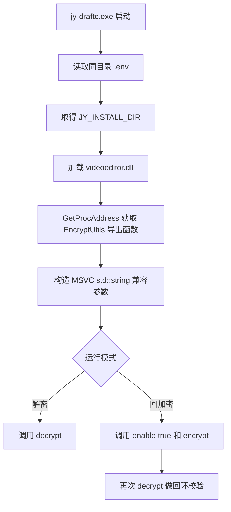

# jy-draftc

`jy-draftc` 是一个用于剪映 Windows 端草稿 JSON 的解密和回加密工具。
它能将草稿内的 `draft_content.json` 和 `draft_meta_info.json` 解密为明文json，并能在修改后回加密。

---

## 适用的版本

#### 下表为项目版本与其支持的剪映版本的关系对照表

- `表内仅展示已验证过的版本，10.3.0之前的版本未验证，但推测6.5.0版本至当前标注版本均可用`

- `仅验证剪映的正式版，测试版不作为最新可验证的版本`

| 项目版本 | 剪映版本 | 备注 |
| --- | --- | --- |
| 0.1.1 | 10.3.0 - 11.4.2 |  |

##### 持续更新中...
##### 目前支持至11.4.2.14459

##### 更新时间：2026-09-15 09:52:42 UTC+8

---

### ✅ MacOS版本 jy-draftc-mac
#### &nbsp;&nbsp;&nbsp;&nbsp;&nbsp;&nbsp;&nbsp;&nbsp;感谢&nbsp;[@vhly](https://github.com/vhly)&nbsp;贡献的适用于MacOS的软件版本
#### &nbsp;&nbsp;&nbsp;&nbsp;&nbsp;&nbsp;&nbsp;&nbsp;[阅读文档](./jy-draftc-mac/README.md)

### ✅ GUI版本 jy-draft-port
#### &nbsp;&nbsp;&nbsp;&nbsp;&nbsp;&nbsp;&nbsp;&nbsp;由&nbsp;[@zzz1999](https://github.com/zzz1999)&nbsp;创建和维护的带GUI的软件版本
#### &nbsp;&nbsp;&nbsp;&nbsp;&nbsp;&nbsp;&nbsp;&nbsp;提供了可视化操作，使操作更加简单
#### &nbsp;&nbsp;&nbsp;&nbsp;&nbsp;&nbsp;&nbsp;&nbsp;[传送至 jy-draft-port](https://github.com/zzz1999/jy-draft-port)

---

## 快速开始

<details>

<summary>查看详情</summary>

### 准备
下载 Windows amd64 分发包后解压，目录里有：

```text
jy-draftc.exe
.env.example
SHA256SUMS.txt
```
打开PowerShell

```powershell
cd 解压路径
cp .env.example .env
```

编辑.env

```env
#这个目录下面必须能找到 videoeditor.dll
JY_INSTALL_DIR=你的剪映安装目录
```

### 开始使用

```powershell
cd 解压路径
```

解密单个文件：

```powershell
.\jy-draftc.exe -d "F:\Draft\draft_content.json"
```

回加密单个文件：

```powershell
.\jy-draftc.exe -e "F:\Draft\draft_content.json.dec.json"
```

手动指定输出路径：

```powershell
.\jy-draftc.exe -d "F:\Draft\draft_content.json" "F:\Draft\draft_content.plain.json"
.\jy-draftc.exe -e "F:\Draft\draft_content.plain.json" "F:\Draft\draft_content.json"
```

批量处理多个文件：

```powershell
.\jy-draftc.exe -d "F:\Draft\draft_content.json","F:\Draft\draft_meta_info.json"
.\jy-draftc.exe -e "F:\Draft\draft_content.json.dec.json","F:\Draft\draft_meta_info.json.dec.json"
```

多文件输入必须用英文逗号分隔。路径里有空格时，用英文双引号包住路径。

</details>

---

## 从源码构建

<details>

<summary>查看详情</summary>

当前源码是单文件 C++ 程序，依赖 Windows API 和 C++17。

使用 MinGW-w64 构建：

```powershell
g++ -std=c++17 -O2 -municode -Wall -Wextra -static -static-libgcc -static-libstdc++ -o jy-draftc.exe src\jy-draftc.cpp
```

编译时可能出现 `GetProcAddress` 到函数指针的类型转换 warning，这是当前手动调用 C++ 导出函数的预期结果。

</details>

---

## 实现原理

<details>

<summary>查看详情</summary>




当前使用到的导出入口：

| 入口 | 作用 |
| --- | --- |
| `EncryptUtils::decrypt` | 把加密文本还原为明文 JSON |
| `EncryptUtils::enable` | 打开 DLL 内部加密开关 |
| `EncryptUtils::encrypt` | 把明文 JSON 加密回剪映格式 |

这里调用的是剪映 DLL 内部逻辑，所以工具本身不分发、不内置 `videoeditor.dll`。

### 已验证的解密入口

```text
?decrypt@EncryptUtils@lvve@@QEAA?AV?$basic_string@DU?$char_traits@D@std@@V?$allocator@D@2@@std@@AEBV34@0AEA_N@Z
```

近似对应：

```cpp
EncryptUtils::decrypt(
    std::string const& encryptedText,
    std::string const& paramJson,
    bool& ok
)
```

### 已验证的加密入口

```text
?enable@EncryptUtils@lvve@@QEAAX_N@Z
?encrypt@EncryptUtils@lvve@@QEAA?AV?$basic_string@DU?$char_traits@D@std@@V?$allocator@D@2@@std@@AEBV34@@Z
```

</details>

---
---

## 相关

### ⭐ jy-draftev
#### &nbsp;&nbsp;&nbsp;&nbsp;&nbsp;&nbsp;&nbsp;剪映 Windows 端的升级或降级草稿结构版本的工具

#### &nbsp;&nbsp;&nbsp;&nbsp;&nbsp;&nbsp;&nbsp;[查看项目](https://github.com/wenshui330/jy-draftev)

### ⭐ Captex
#### &nbsp;&nbsp;&nbsp;&nbsp;&nbsp;&nbsp;&nbsp;剪映 11.1.0.14287 版本的编辑器导出功能的辅助工具

#### &nbsp;&nbsp;&nbsp;&nbsp;&nbsp;&nbsp;&nbsp;[查看项目](https://github.com/wenshui330/Captex)

---

## 使用边界与免责声明

```
使用者应遵守所在地法律法规和相关软件用户协议，仅处理自己有权访问和修改的本地草稿文件。任何违法、侵权或未授权使用行为，均与项目作者无关。
使用本项目造成的任何数据损坏、软件异常、账号风险、法律纠纷或其他后果，均由使用者自行承担。
```

## 鸣谢
感谢[Linux.do](https://linux.do/)站点及其社区为项目开发和交流提供支持。

## 许可证

MIT License。详见 [LICENSE](LICENSE)。
