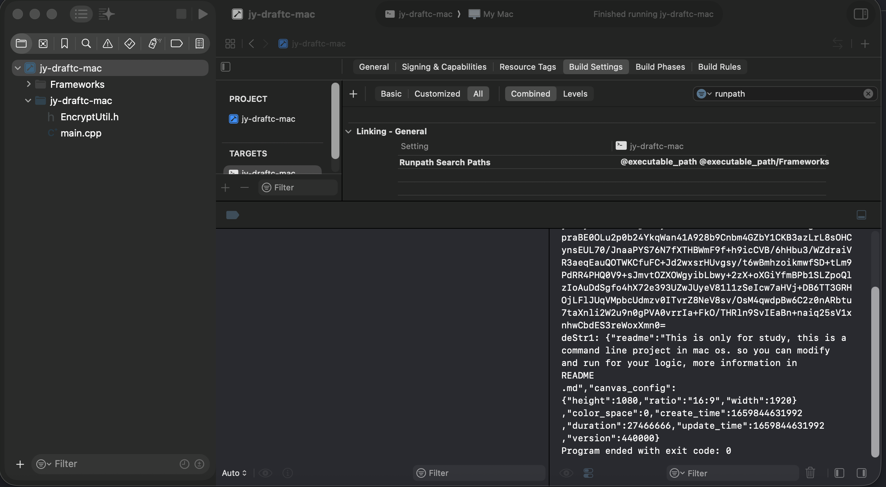
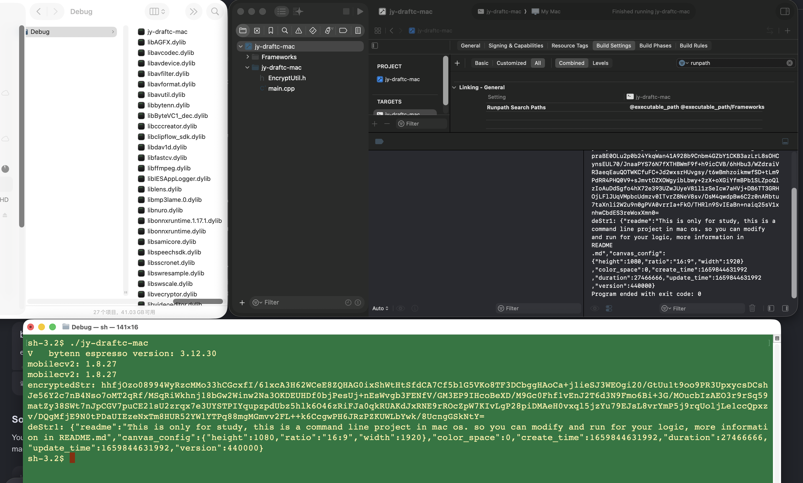

# Study for mac os

## Introduce

1. Invoke dylib for header define directly;
2. Simple invoke and not a production command line;
3. This Project is a Mac OS command line project;
4. Don't signature app;
5. Copy app Frameworks folder *.dylib file in current Frameworks folder;
6. In XCode project General -> Frameworks and Libraries -> Embed Without Signing for all;

## References

- [jy-draftc](https://github.com/wenshui330/jy-draftc)
- [ts-draft](https://draft.dragchain.dev)

## HotFix

- XCode project can run, but product binary in Term report : dylib not found

    * In XCode "Build Settings" and Runpath with "executeable" and "executeable/Frameworks": let binary find dylib in theres
    
    * Run binary in term run success!
    
